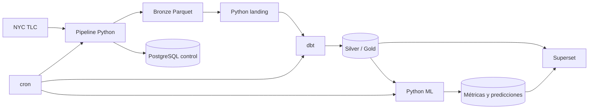

# Ingesta y orquestación original en Python

## Finalidad

Esta carpeta conserva la arquitectura funcional anterior a la migración a
Apache NiFi. No es código sin valor ni un directorio de descarte: constituye
evidencia versionada de la evolución del TFM y permite comparar dos enfoques de
ingesta y orquestación sobre el mismo caso de estudio.

Se conserva para:

- trazabilidad del desarrollo;
- comparación arquitectónica Python + cron frente a NiFi;
- reproducibilidad de los experimentos técnicos anteriores;
- documentación y defensa del TFM;
- recuperación segura mientras se valida la nueva arquitectura.

El código se trasladó desde la implementación activa del commit base
`fbcd537`; antes de retirar la copia raíz se comprobaron 23 ficheros mediante
SHA-256 sin encontrar diferencias.
La lógica ML aparece en el paquete preservado porque formaba parte de la misma
CLI histórica. La implementación ML principal se mantiene y evoluciona fuera
de esta carpeta como servicio independiente.

## Arquitectura preservada



## Componentes

```text
Ingesta Python/
├── README.md
├── Makefile
├── docker-compose.yml
├── configs/
│   └── pipeline.toml
├── docker/
│   ├── pipeline/Dockerfile
│   └── scheduler/
├── pipeline/
│   ├── src/nyc_taxi_pipeline/
│   ├── tests/
│   ├── pyproject.toml
│   └── requirements.lock
└── scripts/
    └── e2e_demo.sh
```

Los modelos dbt, SQL, Superset, datos y artefactos ML no se duplican. El
Compose preservado los referencia desde la raíz porque no pertenecen
exclusivamente a la arquitectura de ingesta Python.

## Funcionamiento

La CLI histórica ofrece:

- `discover`: inventario TLC sin descargar Parquet;
- `plan`: tamaño remoto y capacidad necesaria;
- `run`: ingesta Bronze demo/full, calidad y auditoría;
- `load-landing`: normalización mínima hacia PostgreSQL;
- `train-ml`: entrenamiento demo/full;
- `migrate`: migraciones SQL idempotentes.

El scheduler cron ejecuta Bronze demo, landing, `dbt build` y ML demo.

## Ejecución

Ejecutar desde esta carpeta. Para evitar colisiones de puertos, detenga antes
la arquitectura principal o configure otros valores de `POSTGRES_PORT` y
`SUPERSET_PORT`.

```powershell
Set-Location "Ingesta Python"
docker compose --env-file ../.env config --quiet
docker compose --env-file ../.env up -d --build
docker compose --env-file ../.env run --rm pipeline migrate
docker compose --env-file ../.env run --rm pipeline run --mode demo
```

Pruebas unitarias:

```powershell
docker compose --env-file ../.env run --rm --no-deps `
  --entrypoint python pipeline -m unittest discover -s /app/tests -v
```

El Compose legacy utiliza volúmenes PostgreSQL y Superset propios. Comparte
`../data`, `../logs` y `../ml/artifacts`; no ejecute el modo `full` sin una
decisión deliberada sobre volumen, fechas y concurrencia.

## Dependencias

- Docker Desktop y Docker Compose.
- Python 3.11 dentro de la imagen.
- PostgreSQL 16.
- pyarrow, psycopg, NumPy, scikit-learn y joblib con versiones bloqueadas.
- dbt-postgres en el contenedor scheduler.
- cron para programación.

No se requiere Python local.

## Motivo de la sustitución

NiFi pasa a ser la arquitectura principal porque aporta una representación
visual y modular del flujo, scheduling integrado, colas y backpressure,
reintentos y rutas de error explícitas, Parameter Contexts y Data Provenance.
Python sigue siendo adecuado para ML, pero deja de coordinar la ingesta.

La migración no implica que NiFi sea universalmente superior: aumenta el
consumo de recursos y la complejidad operativa. Esta implementación se mantiene
precisamente para que la comparación se base en evidencia reproducible.
