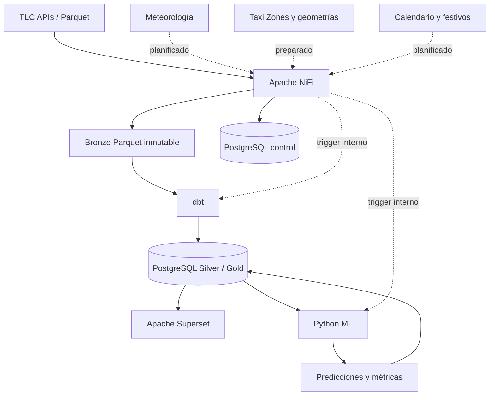

# Arquitectura principal con Apache NiFi

## Estado de la migración

Los estados de esta página significan:

- **IMPLEMENTED**: existe en el repositorio y se ha verificado en ejecución.
- **PARTIAL**: existe una base funcional, pero falta completar o probar algún recorrido.
- **PLANNED**: diseño acordado, todavía no implementado.

| Capacidad | Estado | Evidencia actual |
|---|---|---|
| NiFi 2.10.0 contenerizado y saludable | IMPLEMENTED | `docker-compose.yml`, healthcheck HTTPS |
| Flujo declarativo y bootstrap idempotente | IMPLEMENTED | `nifi/parameters/flow_spec.json`, `nifi/bootstrap/bootstrap.py` |
| Cinco Parameter Contexts sin secretos versionados | IMPLEMENTED | TLC, POSTGRES, PATHS, PIPELINE y EXTERNAL_SOURCES |
| Nueve Process Groups modulares | IMPLEMENTED | smoke test de la API NiFi |
| Catálogo JDBC y Parquet | IMPLEMENTED | pgJDBC 42.7.11, `ParquetReader` 2.10.0 comprobado |
| PostgreSQL como estado de control | PARTIAL | modelo SQL ampliado; falta conectar todas las transiciones NiFi |
| Descarga TLC reutilizable e incremental | PARTIAL | discovery, HTTP, retry, hash y PutFile definidos; falta el encadenamiento completo entre grupos |
| Validación semántica por servicio | PARTIAL | extensión Parquet disponible; contratos Record todavía pendientes |
| Demo NiFi → Bronze → dbt → Silver/Gold → ML | IMPLEMENTED | dos registros sintéticos, Parquet, SHA-256, manifest y reejecución sin duplicados |
| Fuentes externas | PLANNED | contexto y grupo preparados; meteorología y festivos desactivados |

No se ha ejecutado ninguna descarga masiva durante la migración.

## 1. Motivación

La implementación original resolvía discovery, descarga, control, calidad,
scheduling y orquestación dentro de un paquete Python y cron. Sigue preservada
en `Ingesta Python/` por trazabilidad. NiFi pasa a ser la capa principal porque
expone visualmente el flujo, conserva provenance nativo y permite modelar
colas, backpressure, scheduling y rutas de error como configuración operable.
Python se mantiene donde aporta valor específico: entrenamiento, validación
temporal, inferencia y persistencia de modelos.

## 2. Arquitectura anterior

```text
TLC → Python (discovery, download, validate, load, orchestrate) → Bronze/Landing
                                                    ↓
                                                   dbt → Silver/Gold
                                                    ↓
                                             Python ML / Superset
```

La referencia reproducible y sus tests se encuentran en `Ingesta Python/`.

## 3. Arquitectura nueva



Servicios principales: `postgres`, `nifi`, `nifi-bootstrap`, `dbt`, `ml`,
`superset`, `superset-init` y `redis`. `nifi-bootstrap` es un job finito, no un
daemon adicional.

## 4. Responsabilidades de NiFi

NiFi asume discovery mensual parametrizado, HTTP, validación inicial,
persistencia Bronze, scheduling, reintentos finitos, routing de fallos,
provenance y disparo de procesos posteriores. Los Process Groups son:

1. `00_PIPELINE_CONTROL`
2. `05_DEMO_PIPELINE`
3. `10_TLC_DISCOVERY`
4. `20_TLC_DOWNLOAD`
5. `30_BRONZE_VALIDATION`
6. `40_EXTERNAL_DATA`
7. `50_DBT_TRIGGER`
8. `60_ML_TRIGGER`
9. `90_ERROR_HANDLING`

Todos se crean detenidos. Esto evita que clonar o levantar la plataforma inicie
una descarga amplia de forma accidental.

`05_DEMO_PIPELINE` es una vertical autocontenida: genera dos registros con
esquema TLC mínimo, los convierte a Parquet con servicios Record, calcula
SHA-256, escribe Bronze con conflicto `ignore`, hace upsert del manifiesto y de
Landing, ejecuta dbt y llama al servicio ML. La segunda ejecución conserva la
fecha y hash del fichero y mantiene dos filas Landing.

## 5. Responsabilidades de dbt

dbt conserva staging, Silver, cuarentena relacional, dimensiones, hechos,
marts y tests SQL. NiFi puede llamar al endpoint interno `POST /run` del
servicio `dbt`, pero no contiene SQL analítico ni sustituye `dbt build`.

## 6. Responsabilidades de Python

El servicio `ml` conserva feature engineering, partición temporal, comparación
de baseline, Extra Trees y Gradient Boosting, evaluación a 1 h y 24 h,
inferencia y persistencia en PostgreSQL. Solo escucha en la red interna Compose.
La ingesta/orquestación Python original no forma parte del Compose principal.

## 7. Control incremental

PostgreSQL es la fuente de verdad mediante `control.pipeline_runs`,
`control.pipeline_tasks`, `control.ingestion_files` y
`control.data_quality_results`. La migración `006_nifi_control.sql` añade el
orquestador, contadores, reintentos, último error, último intento y los estados
`DISCOVERED`, `DOWNLOADING`, `DOWNLOADED`, `VALIDATED`, `PROCESSED`, `FAILED` y
`QUARANTINED`.

La clave natural de fichero existente —origen, servicio, año, mes y nombre—
impide duplicar el manifiesto. La transición completa consult-before-download y
sus actualizaciones desde NiFi permanecen **PARTIAL**.

## 8. Idempotencia

Bronze usa rutas deterministas y `PutFile` con conflicto `fail`; nunca se
reemplaza silenciosamente un Parquet. El SHA-256 queda previsto antes de la
persistencia. Para considerar idempotencia NiFi completamente cerrada falta
probar automáticamente: fichero nuevo, existente, inválido y reintento agotado.

## 9. Reintentos

`RetryFlowFile` limita los intentos mediante `MAX_RETRIES`; no hay bucles
infinitos. `HTTP_TIMEOUT` parametriza conexión y lectura. PostgreSQL dispone de
`retry_count`, `last_error` y `last_attempt_at`. La actualización transaccional
de esos campos desde todas las rutas es **PARTIAL**.

## 10. Provenance

Los repositorios de FlowFile, contenido y provenance viven en volúmenes Docker
separados. En `https://localhost:8443/nifi`, abrir el menú global y seleccionar
**Data Provenance**. Puede filtrarse por nombre de fichero, componente, UUID o
evento y abrir **View Details / Lineage** para reconstruir el recorrido.

La cadena objetivo es: Discover → HTTP Download → Validate → Manifest Check →
Write Bronze → Register Metadata → Trigger downstream. Actualmente el linaje
queda disponible para los segmentos ejecutados; el recorrido completo es
**PARTIAL**.

## 11. Gestión de errores

`90_ERROR_HANDLING` persiste contenido fallido bajo
`data/quarantine/nifi/` y registra un mensaje terminal. `RetryFlowFile` separa
reintentos de agotamiento. Faltan conexiones intergrupo para centralizar todas
las relaciones `Failure/Retry/No Retry`, por lo que el estado es **PARTIAL**.

## 12. Configuración

La configuración no sensible reside en `flow_spec.json`. El bootstrap toma de
variables de entorno las credenciales y actualiza los Parameter Contexts de
forma idempotente. `.env.example` solo contiene valores locales ficticios;
`.env` no se versiona. NiFi usa HTTPS local con certificado autofirmado.

## 13. Ejecución y verificación

```powershell
Copy-Item .env.example .env
docker compose config --quiet
docker compose up -d --build
docker compose run --rm nifi-bootstrap python /bootstrap/smoke_test.py
docker compose run --rm nifi-bootstrap python /bootstrap/run_demo.py
docker compose ps
```

Accesos locales:

- NiFi: `https://localhost:8443/nifi`
- Superset: `http://localhost:8088`
- PostgreSQL: `localhost:5432`

No ejecute un periodo `full` hasta que la ruta incremental esté cerrada y haya
confirmado espacio y cobertura.

## 14. Limitaciones y siguiente cierre

- Conectar los Process Groups con puertos de entrada/salida y rutas terminales.
- Crear y habilitar Controller Services DBCP/Record para manifiesto y Parquet.
- Implementar contratos mínimos diferenciados para yellow, green, fhv y fhvhv.
- Completar la carga incremental Bronze → Landing sin reintroducir el antiguo
  orquestador Python.
- Automatizar las pruebas funcionales de nuevo/existente/inválido/retry.
- Completar una prueba TLC remota pequeña solo cuando se autorice acceso a red;
  la demo local determinista ya cubre la vertical técnica sin descargar datos.
