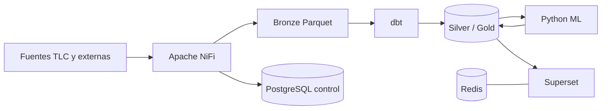

# Arquitectura técnica consolidada

Apache NiFi es la capa principal de ingesta y orquestación. Bronze conserva
Parquet originales; dbt es propietario de Silver/Gold; PostgreSQL almacena el
control y el modelo analítico; Python se mantiene para ML; Superset consume
Gold y las métricas/predicciones.

La implementación reemplazada se conserva en `Ingesta Python/`. El estado
detallado, incluida la distinción entre **IMPLEMENTED**, **PARTIAL** y
**PLANNED**, está en [Arquitectura NiFi](nifi_architecture.md).
