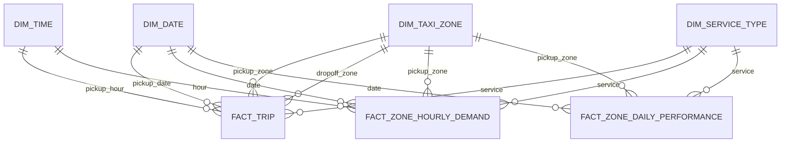

# Arquitectura de fase 4: modelo dimensional Gold

## Resultado

La fase 4 expone tablas Gold estables y consumibles a partir de
`silver.trips`. El modelo se construye por completo con `dbt build`, incluye el
catálogo TLC de 265 zonas como seed y reconcilia el número de viajes entre
Silver y los agregados Gold.

## Modelo dimensional

### Dimensiones

- `gold.dim_date`: calendario del intervalo presente en Silver.
- `gold.dim_time`: 24 horas y franja operativa derivada.
- `gold.dim_service_type`: los cuatro servicios TLC.
- `gold.dim_taxi_zone`: 265 zonas, borough y categoría de servicio.

### Hechos

- `gold.fact_trip`: un registro por viaje válido.
- `gold.fact_zone_hourly_demand`: un registro por fecha, hora, zona de origen
  y servicio.
- `gold.fact_zone_daily_performance`: un registro por fecha, zona de origen y
  servicio.

### Marts

- `gold.mart_mobility_overview`: resumen diario por servicio.
- `gold.mart_service_comparison`: comparación acumulada entre servicios.
- `gold.mart_driver_opportunity`: demanda relativa y cantidad observada por
  hora ocupada.
- `gold.mart_congestion_proxy`: velocidad y minutos por milla como proxies.
- `gold.mart_profitability_scenario`: contribución neta bajo supuestos
  configurables.

## Semántica de las medidas

| Clase | Ejemplos | Interpretación |
|---|---|---|
| Observada | `trip_count`, `observed_trip_amount`, distancia | Procede directamente de campos TLC disponibles. La cantidad monetaria no tiene idéntica cobertura semántica en todos los servicios. |
| Derivada | duración, velocidad, horas ocupadas, demanda relativa | Cálculo determinista sobre valores observados. No incorpora tiempo sin pasajero. |
| Proxy | minutos por milla, velocidad media | Aproximación a congestión; no es una medición directa del tráfico. |
| Estimada | `estimated_net_contribution_scenario` | Escenario sujeto a costes configurables; no representa beneficio neto observado. |

Los servicios sin campo monetario conservan `NULL`; no se transforma la falta
de observación en un importe cero.

## Escenario de rentabilidad

Los valores predeterminados viven en `dbt/dbt_project.yml`:

- comisión: 20 %;
- coste variable: 0,35 por milla;
- coste fijo: 1,50 por viaje.

Son parámetros demostrativos y deben sustituirse por supuestos justificados
antes de presentar resultados económicos.

## Calidad y reproducibilidad

`dbt build` ejecuta tests de unicidad, nulos, dominios, relaciones entre hechos
y dimensiones, medidas no negativas y reconciliación del total de viajes
Silver/Gold. La ejecución de cierre de fase completó 99 de 99 nodos.
