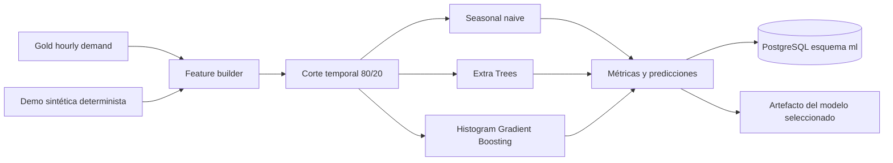

# Arquitectura de fase 5: machine learning reproducible

## Objetivo

Predecir demanda horaria por servicio y zona con horizontes de 1 h y 24 h,
evitando que información futura aparezca en las variables de entrenamiento.

## Flujo

## Variables y fuga temporal

Para un objetivo en `t` y horizonte `h`, el origen de predicción es `t-h`.
Solo se utilizan demanda conocida en el origen, retardos de 1 h y 24 h, media
móvil histórica de 24 h, calendario conocido, servicio y zona. El conjunto de
test contiene exclusivamente fechas posteriores al conjunto de entrenamiento.

## Modelos comparados

1. `seasonal_naive`: valor de la misma hora del día anterior.
2. `extra_trees`: ensemble no lineal de árboles aleatorizados.
3. `hist_gradient_boosting`: boosting sobre histogramas.

La selección se realiza por menor MAE de test, conservando también RMSE, WAPE
y R². Se persisten las predicciones de todos los candidatos; solo se serializa
el modelo ganador por horizonte.

## Modos

- `demo`: 120 días sintéticos, cuatro servicios y tres zonas, semilla fija 42.
- `full`: consume `gold.fact_zone_hourly_demand`, densifica horas sin viajes y
  rechaza conjuntos con menos de 30 días.

Las métricas demo sirven para probar la plataforma y no constituyen evidencia
académica sobre la demanda TLC.

## Resultado reproducible de cierre

Dos ejecuciones consecutivas produjeron exactamente el mismo corte, selección
y métricas. Gradient Boosting fue seleccionado en ambos horizontes:

| Horizonte | MAE | RMSE | WAPE | R² | Muestras test |
|---:|---:|---:|---:|---:|---:|
| 1 h | 2,6067 | 3,4457 | 0,2381 | 0,7675 | 6.804 |
| 24 h | 2,6158 | 3,4598 | 0,2390 | 0,7656 | 6.804 |

Estos valores corresponden exclusivamente a `synthetic_hourly_v1`.
