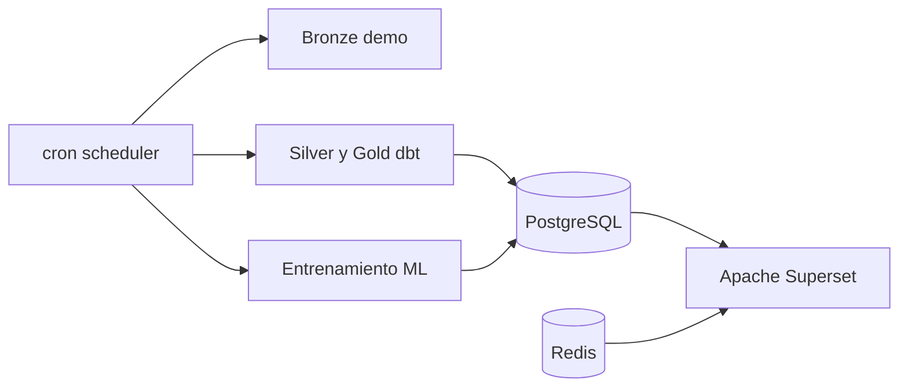

# Arquitectura de fase 6: Superset y scheduler

> Documento histórico: Superset sigue vigente, pero cron/scheduler fue
> sustituido en el Compose principal por NiFi.

## Servicios

- `scheduler`: imagen del pipeline ampliada con cron y dbt 1.8.
- `redis`: caché local de Superset.
- `superset-init`: migraciones, administrador y bootstrap idempotente.
- `superset`: servidor web Superset 6.0.0 en el puerto 8088.

## Programación

`TFM_SCHEDULE_CRON` usa por defecto `0 3 * * *`. El job ejecuta secuencialmente:

1. Bronze demo idempotente.
2. Carga landing demo.
3. `dbt build` completo con 99 nodos.
4. Entrenamiento y persistencia ML demo.

El job manual de cierre completó las cuatro etapas con código de salida cero.

## Dashboards

| Dashboard | Datasets principales |
|---|---|
| Resumen ejecutivo de movilidad | `mart_mobility_overview`, `mart_service_comparison` |
| Análisis geográfico | `mart_driver_opportunity`, `mart_congestion_proxy` |
| Oportunidades para conductores | `mart_driver_opportunity`, `mart_profitability_scenario` |
| Predicción y evaluación | `ml.model_metrics`, `ml.predictions` |

El bootstrap crea siete datasets, ocho gráficos, cuatro dashboards y ocho
relaciones dashboard-gráfico. Todos los títulos orientados al usuario están en
español.

## Reproducibilidad y secretos

La fuente declarativa es `superset/bootstrap_assets.py`. También se conservan
exports ZIP nativos para dashboards y datasources. Ambos bundles se revisaron:
la URI incluye una máscara de diez `X`, sin contraseña ni `SECRET_KEY` en claro.

Las credenciales y el horario llegan exclusivamente por variables de entorno.
Compose usa valores ficticios solo para desarrollo local.
