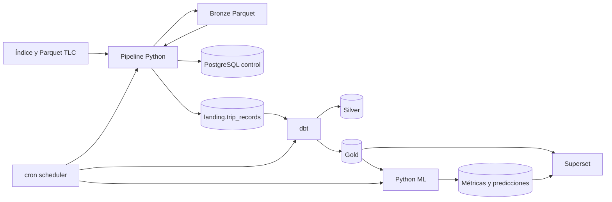
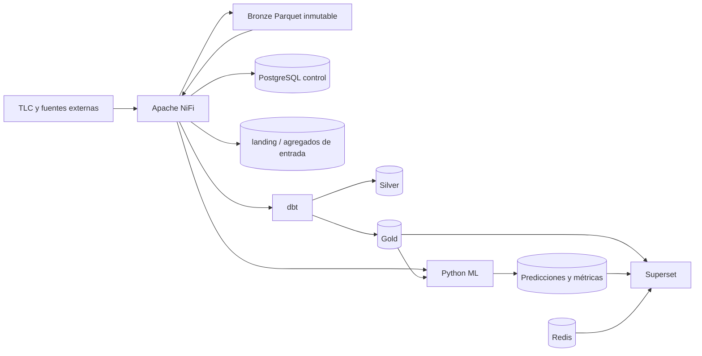

# Auditoría previa a la migración de ingesta y orquestación a Apache NiFi

**Fecha:** 2026-08-13  
**Rama inspeccionada:** `feat/docker-foundation`  
**Commit base:** `fbcd537` (`[ADD] TFM V2`)  
**Estado inicial de Git:** limpio, sin cambios pendientes  
**Alcance:** inspección estática y operacional de solo lectura; no se descargaron datos, no se borraron archivos y no se modificaron volúmenes Docker.

## 1. Resumen ejecutivo

El repositorio actual implementa una vertical demo completa con Python como capa de ingesta y orquestación: descubre ficheros TLC, descarga Parquet, valida Bronze, registra el manifiesto en PostgreSQL, carga una interfaz `landing`, ejecuta dbt y entrena modelos de demanda. Un contenedor cron ejecuta la secuencia y Superset consume Gold y ML.

La migración a NiFi es viable sin sustituir dbt, PostgreSQL, ML ni Superset. La separación no puede hacerse moviendo indiscriminadamente `pipeline/`, porque `nyc_taxi_pipeline.ml` comparte configuración y acceso a PostgreSQL con la ingesta. Primero debe preservarse una copia funcional de la arquitectura actual y, en la arquitectura principal, extraerse ML a un servicio Python independiente.

No hay un bloqueo crítico de pérdida de información. Los riesgos principales son:

1. Bronze contiene 387 Parquet TLC (50.232.683.972 bytes) y debe montarse en NiFi sin reescritura ni borrado.
2. `old/` conserva un prototipo anterior, pero está ignorado íntegramente por Git; no sustituye a la nueva carpeta versionada `Ingesta Python/`.
3. Falta `.env.example`, aunque README y las normas lo requieren.
4. El esquema de estados actual no contempla `DOWNLOADING`, `PROCESSED` ni `QUARANTINED`, ni columnas explícitas de reintento.
5. El cargador Python a `landing` procesa fila a fila y no escala al histórico; NiFi deberá usar lectores de registros y escritura por lotes o una preagregación controlada.
6. Los servicios Python `pipeline` y `scheduler` están activos. Deben preservarse antes de retirarlos de la arquitectura principal para no dejar Compose apuntando a rutas movidas.

## 2. Estado actual

### 2.1 Servicios Docker

| Servicio | Estado y función actual | Destino en la migración |
|---|---|---|
| `postgres` | Persistencia de control, landing, Silver, Gold, ML y metadatos Superset | Se mantiene |
| `pipeline` | CLI Python, ingesta, calidad, carga landing y ML | Se preserva como legado; se sustituye por `nifi` para ingesta y por `ml` para modelos |
| `scheduler` | cron + pipeline + dbt | Se preserva como legado; NiFi asume scheduling y disparadores |
| `dbt` | Transformaciones staging/Silver/Gold y tests | Se mantiene |
| `redis` | Caché y backend de Superset | Se mantiene |
| `superset-init` | Migraciones, administrador y bootstrap declarativo | Se mantiene |
| `superset` | Visualización de Gold y ML | Se mantiene |

### 2.2 Datos locales

| Capa | Archivos | Tamaño observado | Observación |
|---|---:|---:|---|
| Bronze demo | 4 | 11.316 bytes | Sintético, dos filas por servicio |
| Bronze TLC Yellow | 100 | 6.591.506.146 bytes | 2018-01 a 2026-04 |
| Bronze TLC Green | 100 | 369.889.287 bytes | 2018-01 a 2026-04 |
| Bronze TLC FHV | 100 | 3.962.918.035 bytes | 2018-01 a 2026-04 |
| Bronze TLC FHVHV | 87 | 39.308.370.504 bytes | 2019-02 a 2026-04 |

Los datos están excluidos de Git y no deben copiarse a `Ingesta Python/` ni a `nifi/`. Ambas arquitecturas deben referenciar el mismo directorio persistente mediante montajes explícitos, con Bronze tratado como inmutable.

### 2.3 PostgreSQL

Esquemas existentes: `control`, `landing`, `staging`, `silver`, `gold`, `ml`, `reference`, `superset` y `public`.

Tablas de control:

- `control.pipeline_runs`: una fila por ejecución, modo, estado, fechas, parámetros y versión.
- `control.pipeline_tasks`: tareas, métricas, estado y error.
- `control.ingestion_files`: identidad mensual, URL, ruta, tamaño, SHA-256, filas y estado.
- `control.data_quality_results`: resultados auditables por fichero.
- `control.schema_migrations`: migraciones SQL aplicadas.

Interfaces y resultados:

- `landing.trip_records`: columnas comunes de cada fila Parquet.
- `silver.trips` y `silver.trip_quarantine`.
- dimensiones, hechos y marts en `gold`.
- `ml.model_runs`, `ml.model_metrics` y `ml.predictions`.
- esquema `superset` reservado a metadatos internos.

No existe una tabla Bronze relacional, decisión correcta para el volumen disponible.

## 3. Arquitectura actual

El flujo programado actual ejecuta secuencialmente Bronze demo, carga landing, `dbt build` y ML demo. La orquestación se encuentra en Python y shell/cron; dbt conserva correctamente la lógica analítica.

## 4. Componentes Python responsables de ingesta y orquestación

| Componente | Responsabilidad | Clasificación para la migración |
|---|---|---|
| `config.py` | TOML, fechas, servicios, rutas, PostgreSQL y parámetros HTTP | Preservar; sustituir la configuración de ingesta por Parameter Contexts |
| `models.py` | Identidad de fuente y fichero almacenado | Preservar; trasladar el contrato lógico a atributos FlowFile y PostgreSQL |
| `discovery.py` | HTML TLC, regex de nombres, filtros, HEAD y reintentos | Preservar; sustituir por procesadores NiFi y configuración reutilizable |
| `storage.py` | descarga atómica, SHA-256, rutas Bronze y cuarentena | Preservar; sustituir por `InvokeHTTP`, checksum, `PutFile` y rutas de error |
| `quality.py` | legibilidad y columnas mínimas Parquet | Preservar; implementar validaciones equivalentes en NiFi |
| `samples.py` | Parquet demo sintético y determinista | Preservar como prueba de la arquitectura anterior; crear demo NiFi independiente |
| `control.py` | migraciones y persistencia operacional | Preservar; NiFi usará SQL/DBCP sobre las mismas tablas adaptadas |
| `orchestrator.py` | discovery, preflight, concurrencia, estados, errores e idempotencia | Preservar; sustituir por Process Groups y conexiones NiFi |
| `landing.py` | normalización mínima y carga fila a fila | Preservar; sustituir por Record Readers/Writers y carga PostgreSQL por lotes |
| `cli.py` | comandos `discover`, `plan`, `run`, `load-landing`, `train-ml` | Separar: ingesta al legado/NiFi y entrenamiento al nuevo servicio `ml` |
| `runner.py` | comprobación TCP y plan de fase inicial | Preservar como parte del legado |
| `docker/scheduler/*` | cron y secuencia demo | Preservar; sustituir por scheduling NiFi |
| `scripts/e2e_demo.sh` | E2E de la arquitectura Python | Preservar y reemplazar por un E2E NiFi principal |

### Capacidades actuales reutilizables como contrato

- Reconocimiento determinista de `yellow`, `green`, `fhv` y `fhvhv`.
- Particionado `service/year=YYYY/month=MM`.
- Descarga temporal y promoción atómica.
- SHA-256 y separación de demo/TLC.
- Validación Parquet y columnas alternativas por servicio.
- Identidad única de fichero e idempotencia respaldada por PostgreSQL.
- Reintentos limitados y margen de espacio libre.
- Cuarentena sin pérdida silenciosa.
- Logs JSON, códigos de salida y auditoría por tarea.

## 5. Componentes Python que deben mantenerse en la arquitectura principal

Machine Learning no se trasladará a NiFi. Deben extraerse del paquete acoplado:

- generación del panel demo determinista;
- carga de `gold.fact_zone_hourly_demand`;
- densificación horaria;
- features con retardos y calendario sin fuga futura;
- corte temporal 80/20;
- baseline estacional, Extra Trees y Histogram Gradient Boosting;
- métricas MAE, RMSE, WAPE y R²;
- persistencia de ejecuciones, predicciones y artefactos.

El nuevo servicio `ml` solo debe depender de configuración compartida mínima, PostgreSQL y las migraciones ML. No debe conservar imports hacia discovery, storage, landing u orquestación de ingesta.

## 6. Componentes sustituidos por NiFi

NiFi asumirá como arquitectura principal:

- scheduling de demo/full;
- creación y cierre de ejecuciones;
- generación del inventario servicio/año/mes;
- comprobación incremental en PostgreSQL;
- petición HTTP y validación de respuesta;
- descarga y escritura Bronze;
- atributos de procedencia y checksum;
- validación inicial y enrutado a cuarentena;
- reintentos finitos y rutas de error;
- carga/preparación de la interfaz relacional para dbt;
- disparo de dbt y ML;
- trazabilidad visual y Data Provenance.

NiFi no asumirá transformaciones Silver/Gold, entrenamiento, evaluación, inferencia ni visualización.

## 7. dbt

El proyecto dbt está separado correctamente y se mantiene:

- source `landing.trip_records`;
- staging tipado y motivo de invalidez;
- `silver.trips` y `silver.trip_quarantine`;
- dimensiones de fecha, hora, servicio y 265 zonas;
- hechos de viaje, demanda horaria y rendimiento diario;
- cinco marts de movilidad, comparación, oportunidad, congestión y rentabilidad;
- tests de unicidad, nulos, dominios, relaciones, medidas y reconciliación.

Riesgo: dbt-postgres no lee directamente los Parquet locales. La migración necesita mantener una interfaz `landing` alimentada por NiFi o introducir una preagregación explícita antes de dbt. No debe documentarse `Bronze -> dbt` como conexión directa mientras esa interfaz siga siendo necesaria.

## 8. Superset

Superset está desacoplado de la ingesta y no requiere cambios funcionales:

- configuración declarativa;
- PostgreSQL como metabase bajo el esquema `superset`;
- Redis para caché y tareas;
- siete datasets Gold/ML;
- ocho gráficos;
- cuatro dashboards publicados;
- ZIP exportables con contraseña enmascarada.

Solo debe actualizarse la documentación de procedencia para mostrar NiFi como productor de Bronze/landing.

## 9. Dependencias y acoplamientos

### Python

- Python 3.11.
- `pyarrow` para Parquet y demo.
- `psycopg` para control, landing y ML.
- `numpy`, `scikit-learn`, `scipy` y `joblib` para ML.
- biblioteca estándar para HTTP, concurrencia, hash y CLI.

El lock contiene dependencias de ingesta y ML en una sola imagen. La migración debe reducir el nuevo contenedor ML y mantener el lock original en `Ingesta Python/` para reproducibilidad.

### Variables y rutas

- `TFM_CONFIG_PATH`, `TFM_DATA_ROOT`, `TFM_LOGS_ROOT`, `TFM_SQL_ROOT`.
- `TFM_DATABASE_HOST`, `TFM_DATABASE_PORT`, `POSTGRES_DB`, `POSTGRES_USER`, `POSTGRES_PASSWORD`.
- `TFM_TLC_INDEX_URL`, `TFM_CODE_VERSION`, `TFM_SCHEDULE_CRON`.
- Superset usa además `SUPERSET_SECRET_KEY` y credenciales de administrador.

No hay rutas absolutas en el código principal. `old/` sí conserva rutas históricas y archivos sensibles ignorados, por lo que no se incorporará a la migración.

### Volúmenes

- `postgres_data`: persistencia relacional; no se elimina.
- `superset_home`: metadatos y estado Superset; no se elimina.
- `./data`: Bronze y cuarentena; se compartirá con NiFi.
- `./logs`: logs y manifiesto actual; se conserva.
- `./ml/artifacts`: modelos locales; se conserva para el servicio ML.

## 10. Riesgos técnicos

| Riesgo | Nivel | Tratamiento |
|---|---|---|
| Copiar o reescribir 50,23 GB de Bronze durante la migración | Crítico | Solo montar el directorio; pruebas con demo o un fichero pequeño ya disponible |
| Perder la arquitectura Python al mover rutas | Alto | Crear primero una preservación versionada y verificable |
| Romper ML al retirar el paquete `nyc_taxi_pipeline` | Alto | Extraer y probar `ml` antes de retirar `pipeline` principal |
| Flujo NiFi creado solo en UI | Alto | Bootstrap declarativo y definición exportable/versionada |
| Credenciales dentro de Parameter Contexts exportados | Crítico | Valores sensibles desde entorno; plantillas solo con marcadores |
| Carga fila a fila de miles de millones de viajes | Crítico | Record processors por lotes y diseño de preagregación para full |
| Estados SQL incompatibles con NiFi | Alto | Migración aditiva de estados y columnas; no destruir filas existentes |
| Duplicación por concurrencia | Alto | clave única existente más adquisición/actualización transaccional de estado |
| Reintentos infinitos o duplicados | Alto | contador y máximo parametrizado; penalización y ruta final de error |
| Procesadores/versiones NiFi incompatibles | Medio | versión Docker fijada, validación de Compose y smoke test REST |
| Recursos de NiFi en Docker Desktop | Medio | límites razonables y demo pequeña; documentar memoria necesaria |
| Lanzar dbt/ML desde NiFi mediante socket Docker | Crítico | No montar `docker.sock`; usar servicios internos controlados o endpoints dedicados |

## 11. Riesgos de seguridad y publicación

- `.env` existe y está ignorado; no debe moverse, copiarse ni versionarse.
- `.env.example` falta y debe crearse con valores ficticios.
- Los valores sensibles de NiFi deben inyectarse en ejecución.
- No debe versionarse `flow.json.gz` si contiene valores sensibles cifrados con una clave local.
- `old/Conexión Cremaet.txt` está ignorado y no se copiará.
- Las exportaciones Superset deben volver a revisarse tras cualquier bootstrap.
- Deben fijarse imágenes por versión y documentar licencias.
- No se reescribirá el historial Git ni se publicará el repositorio en esta tarea.

## 12. Arquitectura objetivo adaptada al repositorio real

El socket Docker no se expondrá a NiFi. Los disparadores downstream deben usar contratos de servicio explícitos o comandos encapsulados en contenedores diseñados para ello.

## 13. Plan incremental de migración

### Fase A — Preservación Python

1. Crear `Ingesta Python/` versionada.
2. Conservar código, tests, configuración, scripts y Docker de la arquitectura actual.
3. Añadir README, Compose legacy/overlay y comandos de ejecución.
4. Comprobar hashes o diff de los archivos preservados.

### Fase B — Separación de ML

1. Crear paquete y contenedor `ml` independientes.
2. Extraer solo configuración PostgreSQL y lógica predictiva.
3. Mover/adaptar tests ML.
4. Validar entrenamiento demo y persistencia sin depender del pipeline antiguo.

### Fase C — Base NiFi

1. Crear `nifi/` con bootstrap, flujos, parámetros, scripts, SQL y documentación.
2. Fijar una versión soportada de NiFi.
3. Añadir `nifi` y su inicializador a Compose con healthcheck y almacenamiento persistente.
4. Configurar autenticación local y secretos únicamente por entorno.

### Fase D — Control, discovery y descarga

1. Ampliar el esquema `control` de forma aditiva.
2. Crear Parameter Contexts y Process Groups.
3. Implementar inventario parametrizado y flujo reutilizable para cuatro servicios.
4. Implementar control incremental, HTTP, checksum, Bronze, retry y error handling.

### Fase E — Landing, dbt y ML

1. Procesar Parquet mediante Record API en modo demo.
2. Escribir `landing` por lotes e idempotentemente.
3. Disparar dbt y ML mediante interfaces internas seguras.
4. Mantener toda la lógica Silver/Gold en dbt.

### Fase F — Validación y documentación

1. Sustituir el E2E principal por NiFi.
2. Probar fichero nuevo, duplicado, inválido y reintento.
3. Validar Process Groups, Parameter Contexts y provenance.
4. Actualizar README, Makefile, arquitectura y comparación Python/NiFi.
5. Marcar explícitamente `IMPLEMENTED`, `PARTIAL` o `PLANNED`.

## 14. Criterio para continuar

La auditoría no identifica un riesgo que obligue a detener la migración. Se puede continuar si se cumplen estas salvaguardas:

- preservar antes de retirar;
- no copiar ni mover `data/`, volúmenes o `.env`;
- no montar el socket Docker;
- mantener PostgreSQL/dbt/Superset compatibles durante la transición;
- validar cada fase antes de retirar el servicio Python equivalente;
- no ejecutar la descarga histórica full.

La primera implementación ejecutable será la preservación de la arquitectura Python, seguida de la extracción de ML y la base NiFi. La descarga TLC completa queda fuera de esta tarea.
